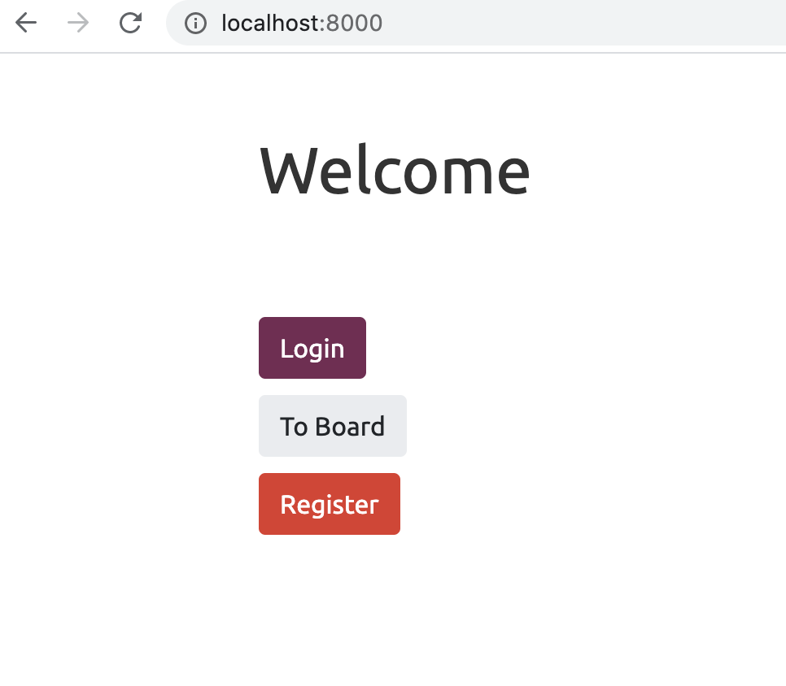
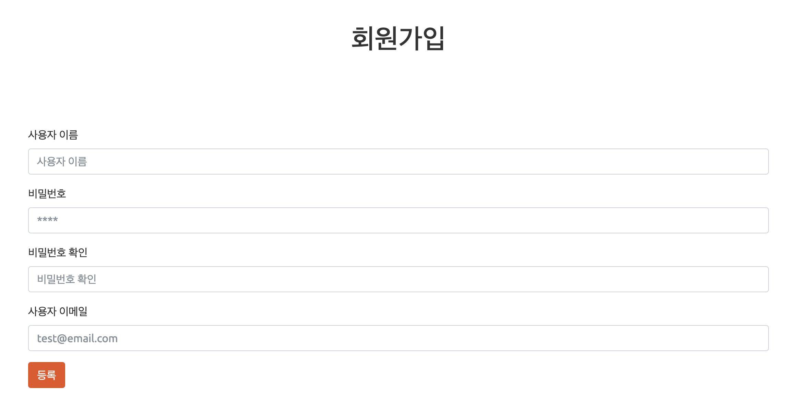
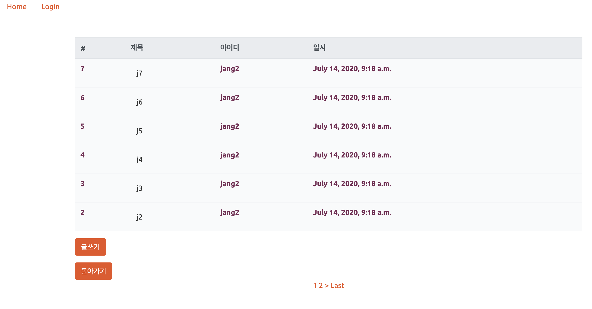

# Community_Django
Django made Community site. I followed a tutorial and added some new functions.  
It works with 3 apps. 'main', 'user', 'board'.  
I added pagenation and the main app using new functions at view. 
   
 
 ## Tech Stack
 * [Django](https://www.djangoproject.com/)  
 * [PostgreSQL](https://www.postgresql.org/)
 * Python  
   
 ## For ones who want to use.
 Install django, postgreSQL and psycopg2. With postgreSQL make a user name 'postgres'  
 with password 'asdf111', and create Database name djangojang.  
 
  
 ## Example  
   
 #### Main page    
   
   
   
 #### Register    
   
  
  
 #### Board    
   
   
